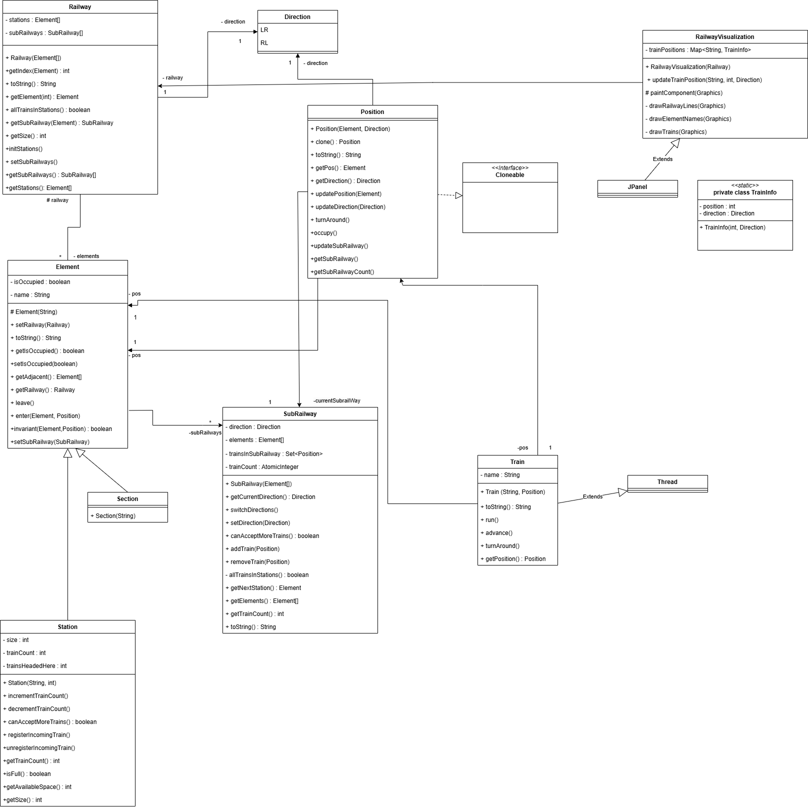

# TP CONC mu project ex 3

## By Othmane EL AKRABA and Soufiane LACHGUER

## Concurrent trains
In this code, we are trying to code trains running in a railway section using concurrent programming. In this model, each railway begins and ends with a train station. Between the stations are sections that trains can pass through. Only one train can pass through each section at a time, and all running trains need to be following the same direction of movement (either left to right or right to left). Many trains cen be in the same train station however, but the maximum number of trains is fixed by the train's station maximum capacity.

## Quick Start
To activate the simulation, first clone the project from Github using this command:
git clone https://github.com/slach31/conc_trains
Import the project on your IDE's workspace (and switch to the branch ex3).
Now you can simulate your concurrent trains, to do so open the train package and run the main file.
You can see that stations, sections, railways and trains are already created and their values are set by default. If you want to change their values and try a simulation with a different number of elements, you can do so by editing the class main.

## Development
This project is developed by Othmane EL AKRABA and Soufiane LACHGUER, for a university project related to concurrency. It uses Java 23.0.1. Files are shared via Github.
If you encounter any technical problems regarding this project, you can write to us at soufiane.lachguer@imt-atlantique.net or at othmane.el-akraba@imt-atlantique.net

## Conception
This image shows the class diagramm used to develop this model :

This class diagram models a simple railway system in which trains, running on separate threads, move across various elements such as stations and track sections. At the highest level, a `Railway` object manages an array of `Element` objects and provides functionality like retrieving elements by index, checking if all trains are currently in stations, and switching direction. Each `Element` in the railway can be either a `Section` or a `Station`, and it holds information such as a name and whether it is currently occupied by a train. Elements also provide methods that control train occupancy (like entering or leaving) and enforce certain constraints via an `invariant` check on direction and occupancy.

To give elements a sense of orientation, the `Direction` class enumerates possible directions—left-to-right (LR) or right-to-left (RL). Meanwhile, the `Position` class pairs an `Element` with a `Direction` and offers functionality like updating the element or direction, turning around, and marking an element as occupied. Notably, `Position` implements the `Cloneable` interface, allowing positions to be duplicated if necessary.

Within this system, a `Train` object is a specialized thread that runs autonomously. Each train has a name and a `Position`, and its `run()` method handles the logic for moving the train along the track. Trains can advance from one element to another, turn around, and interact with the elements’ occupancy states. Stations (`Station`) are a specific type of element with an additional `size` attribute, potentially signifying capacity constraints. By combining all these classes, the diagram provides a framework to simulate multiple trains (as concurrent threads) moving along a railway, occupying stations or sections, and changing direction as needed.
