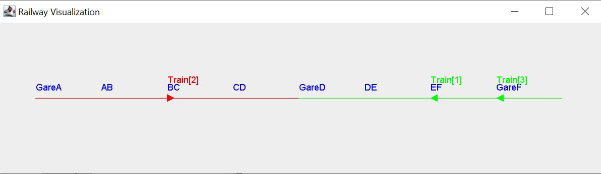

# TP CONC mu project ex 4

## By Othmane EL AKRABA and Soufiane LACHGUER

## Concurrent trains
In this code, we are trying to code trains running in a railway section using concurrent programming. In this model, each railway begins and ends with a train station. Between the stations are sections that trains can pass through. Only one train can pass through each section at a time, and all running trains need to be following the same direction of movement (either left to right or right to left) in each subrailway. Many trains cen be in the same train station however, but the maximum number of trains is fixed by the train's station maximum capacity.

## Quick Start
To activate the simulation, first clone the project from Github using this command:
git clone https://github.com/slach31/conc_trains
Import the project on your IDE's workspace (and switch to the ex4part2 branch).
Now you can simulate your concurrent trains, to do so open the train package and run the main file.
You can see that stations, sections, railways, subrailways and trains are already created and their values are set by default. If you want to change their values and try a simulation with a different number of elements, you can do so by editing the class main.

## Result visualization
For this exercise, we added a simple JFrame interface to visualize the trains and the railway. Below is an example of the interface : 

Each train is symbolized via a triangle pointing to the direction that the train runs towards. Each train has a color : a red train symbolizes that the train runs left to right, while a green train symbolizes that the train runs right to left. This color scheme is also shared for the subrailways : a red subrailway means that all the trains on the subrailway run (and must run) from left to right, while a green subrailway means that all the trains on the subrailway run (and must run) from right to left. The color of a given subrailway changes depending on the direction of the first train that enters a given subrailway after it empties.  

Also, the railway's status is given via text on the console. However, keep in mind that the console gives a train's information , named as a thread. In all cases, for a given Train numbered n, the corresponding Thread is n-1 (on the console). For example, if the console shows the thread 0, it gives information about train number 1, and so on. 

## Development
This project is developed by Othmane EL AKRABA and Soufiane LACHGUER, for a university project related to concurrency. It uses Java 23.0.1. Files are shared via Github.
If you encounter any technical problems regarding this project, you can write to us at soufiane.lachguer@imt-atlantique.net or at othmane.el-akraba@imt-atlantique.net

## Conception
This image shows the class diagramm used to develop this model :

This diagram outlines a more comprehensive railway simulation system where trains, elements, and sub-railways all interact. At the core, the **Railway** class manages a collection of `Element` objects (which can be stations or track sections) along with multiple `SubRailway` segments. Each **Element** keeps track of whether it is occupied, has a name, and provides methods for trains to enter or leave. Stations (`Station`) add capacity management, allowing multiple trains but also providing methods for registering or decrementing train counts.

A **SubRailway** groups together a set of elements under a specific `Direction`, maintaining a list of the trains currently on those elements. It can add or remove train positions, determine whether all trains are at stations, and retrieve individual elements or stations. Meanwhile, the `Position` class encapsulates both an `Element` and a `Direction`, allowing trains to be placed precisely on the railway and reoriented (e.g., turning around). `Position` also implements `Cloneable` so that train positions can be duplicated if necessary.

Each **Train** runs on its own thread, using its `Position` to move incrementally along the railway. It exposes operations such as `advance()` (to progress to the next element), `turnAround()` (to change direction), and `run()` (defining the train’s main execution loop). The system also includes a **RailwayVisualization** component (extending `JPanel`), which handles graphical representation: storing each train’s position and direction, and drawing the railway, its sections, and trains accordingly. This allows a real-time or interactive view of trains moving across different sub-railways, stations, and track elements.
